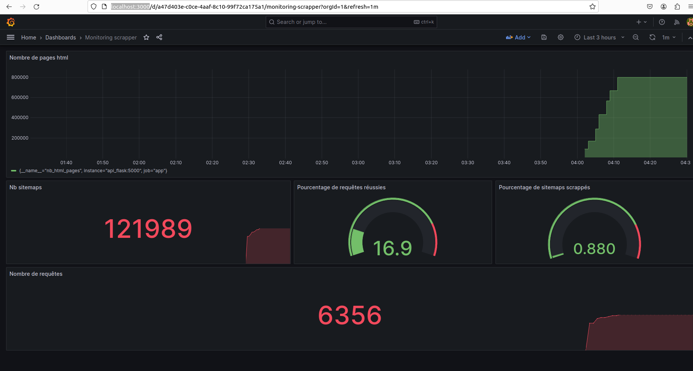
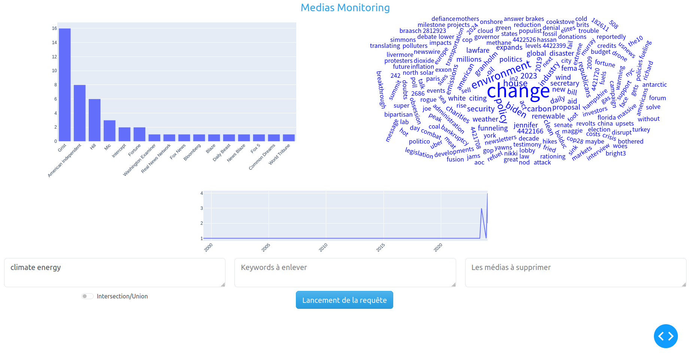

# WebScrapping
## Ceci est le repos du projet de WebScrapping 

L'application est en réalité plusieurs services fonctionnant dans des dockers.
Cette option permet une conteneurisation absolue et une gestion des dépendances.

### Lancer le projet

```bash
docker-compose -f docker-compose.prod.yml up -d --build
``` 
L'ensemble des installations va être automatiquement lancé. Enfin, le scrapper ainsi que l'ensemble des services seront lancés.


### Définir le nombre de cycles de crawling 

Le nombre de cycle de crawling est actuellment à 10 mais il peut-être modifié dans le fichier docker-compose.prod.yml.
Il est possible de mettre 0 si on souhaite uniquement regarder les logs grafana ainsi que le dashboard.
```yaml
  scrapper:
    build:
      context: ./scrappers
      dockerfile: Dockerfile
    container_name: scrapper
    command : [ "python", "crawling_async.py", "mongodb", "10" , "--crawling_robots=0"]
    networks:
      scrapper:
```
Attention, si le nombre de cycles de scrapping définit est important, il faudra penser à indexer la base de données Mongodb pour pouvoir faire des requêtes dans le dashboard. Enfin, le scrapper pourra prendre du temps avant de finir l'ensemble de ces cycles.

### DashBoard & Grafana

Grafana est accessible pour monitorer le scrapper sur l'addresse :  http://localhost:3000


Un DashBoard est disponible sur l'addresse : http://localhost:8000/


### Choix d'architecture

Les données scrappées sont stockées dans une base de données MongoDB. Pour être plus précis, l'ensemble des données est stockée dans un volume docker.
Ces données ne sont donc pas perdues si la machine s'éteint car elles sont stockées sur la machine. C'est aussi le cas pour les données concerant Prometheus et grafana.
Il est donc possible d'arrêter le scrapping et le reprendre plus tard.
Enfin, une api flask, prometheus et grafana sont déployés pour monitorer le scrapper.

### Liste des fichiers

/api_flask contient l'api flask utile pour prometheus
/dash_app contient le dashboard de DataViz
/grafana contient les fichiers de configuation pour grafana 
/scrappers contient les scrappers

### Commandes utiles

Arrêter les services
```bash
docker-compose -f docker-compose.prod.yml down
```

Voir l'état des services
```bash
docker-compose -f docker-compose.prod.yml ps
```

Voir les logs du scrapper
```bash
docker-compose -f docker-compose.prod.yml logs scrapper --follow
```