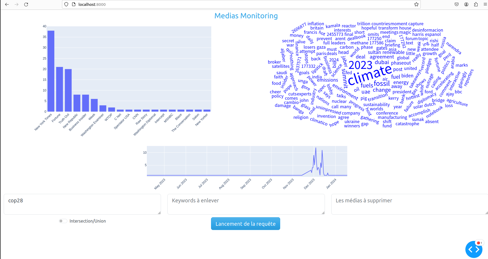

# WebScrapping
## Le Projet

Petit point de vocabulaire : Les termes scrapper et crawler seront utilisés, dans notre cas nous avions bien développé un crawler, c'est-à-dire un programme qui récupére des urls pour les indexer. Les deux termes seront utilisés mais désignent la même chose.

Le projet consiste à développer un outil permettant de monitorer ce qu'il se dit à propos d'un sujet.
On peut ainsi rechercher le terme climat et voir à quel moment dans les médias la question du climat a été abordé, 
quels ont été les termes employés, qui en a parlé le plus, etc ...

Etant donné le caractère universel de cette capacité, il est possible de faire des requêtes sur absolument n'importe quel sujet.

Voici un exemple avec Elon Musk, on remarque une très forte association 
d'Elon Musk avec twitter et ce depuis son rachat dès avril 2022. On remarque d'ailleurs que Tesla et SpaceX sont peu présents par rapport à Twitter.


## Lancer l'application

L'application développée est en réalité plusieurs services fonctionnant dans des dockers.
Cette option permet une conteneurisation et une gestion des dépendances.

```bash
docker-compose -f docker-compose.prod.yml up -d --build
``` 
L'ensemble des installations et des services va être automatiquement lancé. 

## Définir le nombre de cycles de crawling 

Le nombre de cycle de crawling est actuellement à 10 mais il peut-être modifié dans le fichier docker-compose.prod.yml.
Il est possible de mettre 0 si on souhaite uniquement regarder les logs grafana ainsi que le dashboard.
```yaml
  scrapper:
    build:
      context: ./scrappers
      dockerfile: Dockerfile
    container_name: scrapper
    command : [ "python", "crawling_async.py", "mongodb", "10" , "--crawling_robots=0"]
    networks:
      scrapper:
```
Attention, si le nombre de cycles de scrapping défini est important (plus de 25), il faudra penser à indexer la base de données Mongodb pour pouvoir faire des requêtes dans le dashboard. Enfin, le crawler pourra prendre du temps avant de finir l'ensemble de ces cycles.

## DashBoard & Grafana

Grafana est accessible pour monitorer le scrapper sur l'addresse :  http://localhost:3000


Un DashBoard est disponible sur l'addresse : http://localhost:8000/



## Choix d'architecture

Les données scrappées sont stockées dans une base de données MongoDB. Pour être plus précis, l'ensemble des données est stockée dans un volume docker.
Ces données ne sont donc pas perdues si la machine s'éteint car elles sont stockées sur la machine. C'est aussi le cas pour les données concernant Prometheus et grafana.
Il est donc possible d'arrêter le crawling et le reprendre plus tard.
Enfin, une api flask, prometheus et grafana sont déployés pour monitorer le crawler.

## Fonctionnement du scrapper

Le crawler scanne un liste de médias américains en allant regarder ce qui se trouve dans chaque robots.txt.
Or dans ces fichiers se trouvent régulièrement des urls qui sont les index du site (des urls contenant sitemap).

Notre crawler va récursivement récupérer ces sitemaps et trouver les liens html contenus dans ces fichiers. Les sitemaps sont scrappés par batch/cycle, autrement dit pendant un cycle, 1 sitemaps par site est scrappé de manière asynchrone. Autrement dit à chaque cycle, plusieurs centaines/dizaines de requêtes sont envoyées en même temps (de manière concurrente) et sont traités lorsqu'elles sont reçues. Mais à aucun moment, un site ne reçoit plusieurs requêtes concurrentes.

Toutes ces données sont ensuite mises dans la base de donnée MongoDB (les nouveaux sitemaps et les articles detectés).
Enfin, les sitemaps.xml qui viennent d'être scrappés voient leur attribut has_been_scrapped définit à true pour ne plus les scrapper dans le futur.

## Exemple avec LeMonde.fr
Nous allons montrer le fonctionnement du crawler avec le site lemonde.fr.
Note : Il n'a pas été crawler.

Le robots.txt se trouve à l'addresse : https://www.lemonde.fr/robots.txt
Il contient des sitemaps :
```xml
Sitemap: https://www.lemonde.fr/sitemap_news.xml
Sitemap: https://www.lemonde.fr/sitemap_index.xml
Sitemap: https://www.lemonde.fr/en/sitemap_news.xml
Sitemap: https://www.lemonde.fr/en/sitemap_index.xml
```

On découvre en poursuivant le parcours des sitemaps, des articles du journal Le Monde :
```xml
<url>
    <loc>
    https://www.lemonde.fr/international/article/2024/01/25/guerre-en-ukraine-questions-apres-le-crash-d-un-avion-russe_6212827_3210.html
    </loc>
    <lastmod>2024-01-25T04:30:07+01:00</lastmod>
    <news:news>
        <news:publication_date>2024-01-25T04:30:07+01:00</news:publication_date>
        <news:title>
        Guerre en Ukraine : questions après le crash d’un avion russe
        </news:title>
        <news:publication>
        <news:name>Le Monde</news:name>
        <news:language>fr</news:language>
        </news:publication>
    </news:news>
    <image:image>
        <image:loc>
            https://img.lemde.fr/2024/01/24/422/0/5105/2552/1440/720/60/0/55d3ce5_2024-01-24t161100z-883304909-rc2do5a7czzq-rtrmadp-3-ukraine-crisis-belgorod-airplane.JPG
        </image:loc>
        <image:caption>
            Des policiers russes montent la garde sur la route menant au site du crash de l’avion de transport militaire russe IL-76, à Yablonov, dans la région de Belgorod (Russie), le 24 janvier 2024.
        </image:caption>
    </image:image>
</url>
```

Les données de date de publication, de l'url sont récupérées, les mots dans l'url sont parsés.
Il en résulte des données enregistrées sous ce format dans une collection de la base de données MongoDB.
```json
{
    "url": "https://www.lemonde.fr/international/article/2024/01/25/guerre-en-ukraine-questions-apres-le-crash-d-un-avion-russe_6212827_3210.html",
    "mots_in_url" : ["international","2024", "01", "25", "guerre", "ukraine", "questions", "apres", "crash", "avion", "russe", "6212827", "3210"], 
    "media_name" : "lemonde.fr",
    "id_media" : 1245,
    "has_been_scrapped" : false,
    "xml_source" : "https://www.lemonde.fr/sitemap_news.xml",
    "date": "2024-01-25T04:30:07+01:00",
    "text": null,
}
```

### Parsing des Urls et Index 

Le parsing des urls sous la forme d'un array permet de faire des index et donc des requêtes très rapides. Uniquement, les mots pertinents sont récupérés grâce à des stopwords.

Des tests très concluants avec 20 millions de données ont été effectués : Une requête renvoyant 400K à 500K documents à été testé 
selon les index utilisés. L'utilisation d'un index sur un array contenant les termes de l'url parsé s'est avéré la méthode la plus efficace.
Ces indexes ne sont pas encore automatiquement crées dans le code.


Une deuxième collection est mise à jour en parallèle pour rajouter les nouveaux sitemaps découverts et mettre à jour ceux qui ont été scrappés pour ne pas repasser par les mêmes. Il est à noter qu'aucune contrainte d'unicité n'est implantée, pour autant le nombre de doublons ne semble pa significatif.
Les informations contenues dans le robot.txt y sont aussi stockées.
Les données sont sous cette forme : 
```json
{
    "site_web_url": "https://www.lemonde.fr/", "media_name": "lemonde.fr" , "media_coverage" :  "" ,  "media_diffusion" : "" , 
    "media_location" : "France" , "coverage" : "national" , "true_country" : "FRance", 
    "sitemaps_xml": [ 
                        {"url":"xml1",  "has_been_scrapped" : true ,"is_responding": true,  "parent_xml" : "robots.txt", "depth":0},
                        {"url":"xml2", "has_been_scrapped" : true ,"is_responding": true, "parent_xml" : "xml1", "depth":1}, 
                        {"url":"xml3", "has_been_scrapped" : false ,"is_responding": true, "parent_xml" : "xml1", "depth":1}, 
                        {"url":"xml4", "has_been_scrapped" : true ,"is_responding": true, "parent_xml" : "xml2", "depth":2}, 
                        {"url":"xml5", "has_been_scrapped" : false ,"is_responding": false, "parent_xml" : "xml2", "depth":2}, 
                    ],
    "robots_txt_parsed" :  {"Disallow": ["/synsearch/", "..." ], "Allow": []} ,
    "last_time_scrapped" : "",
    "is_responding" : true,
    "robots_txt": "..."
}
```

### Variété, exhaustivité et qualité des données

Si le but initial était de pouvoir fournir une analyse multi-pays, le projet s'est rabattu sur un pays uniquement (les Etats-Unis mais il aurait été possible d'en prendre un autre) pour des raisons de latence et computationelles.

La plupart des sites de médias crawlés sont régulièrement peu à jour et ne contiennent pas toujours des sitemaps. Les grands médias sont plus fournis. Une autre difficulté concerne les sites qui générent un sitemap.xml par jour, ce qui rend très difficile de scrapper l'ensemble des articles. Sur 5 ans, cela réprésenterait, 5*360=1500 et donc autant de cycles de crawling à effectuer. 

La donnée de date de publication varie de qualité selon les sites, elle n'est pas toujours présente et parfois elle représente la date de modification. Cela se voit parfois quand on apercoit de gros pics dans le DashBoard : Cela signifie qu'une mise à jour à eu lieue sur un site et donc plusieurs milliers articles ont eu leur attribut "lastmod" (last modification) modifié dans les sitemaps. Or ce champ est régulièrement utilisé pour renseigner la date de publication en l'absence du champ "news:publication". On peut voir ces champs dans l'exemple avec LeMonde.fr

Nous avons préféré être large et ensuite filtrer.

## Liste des fichiers

- /api_flask contient l'api flask utile pour prometheus 
- /dash_app contient le dashboard de DataViz 
- /grafana contient les fichiers de configuration pour grafana 
- /scrappers contient les scrappers
    - /scrappers/crawling_async.py contient le code essentiel pour crawler récursivement, insérer et mettre à jour la base de données MongoDB
    - /scrappers/Medias_scrapping.py contient un code utilisé pour se constituer une base de données de médias grâce au site https://www.abyznewslinks.com/allco.htm
- /Notebooks contient des notebooks de test 

## Commandes utiles 

Arrêter les services
```bash
docker-compose -f docker-compose.prod.yml down
```

Voir l'état des services
```bash
docker-compose -f docker-compose.prod.yml ps
```

Voir les logs du crawler
```bash
docker-compose -f docker-compose.prod.yml logs scrapper --follow
```

Voir les volumes docker
```bash
docker volume ls | grep webscrapping
```

Lancer un MongoDB de test avec les données scrappées sur le localhost
```bash
docker run -d -p 27017:27017 -v webscrapping_mongodb-data:/data/db --name mongo_test mongo:latest
```

Supprimer ce même conteneur
```bash
docker ps | grep mongo_test | awk '{print $1}' | xargs docker stop  | xargs docker rm
```